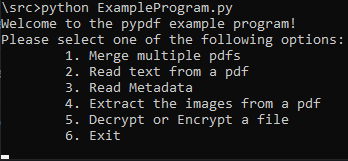
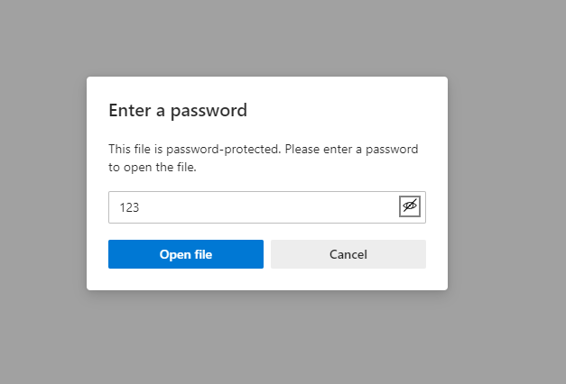
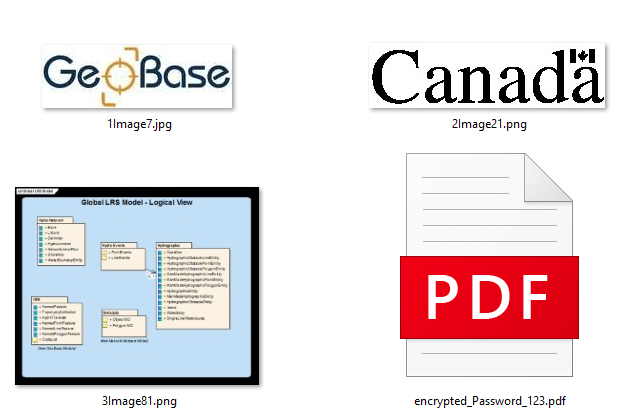

# Exploration Activity 01
### Python | Libary: *pypdf*
The library pypdf is made for python and has a variety of functionalities relating to modifying, creating, and parsing pdf files. The sample program showcases 7 of its usefull functionalities such as merging, encrypting, and extracting images to name a few.

## How to Run the Sample Program
Cloning the source folder should be sufficient. From the terminal you will be able to run the sample program with a simple *python ExampleProgram.py*. The pdf files are kept in the ***input*** folder and the results of operations are placed into the ***output*** folder.
> To install pypdf: *pip install pypdf*

The program has a variety of useful functions that each hold one of the aspects of pypdf's functionality such as merging multiple pdf files, reading text from files, extracting images from files, encrypting and decrypting files, and extracting metadata from a pdf file.

# Sample Input and Output
The sample input and output already included with the program are the text extracted from the pdf file *Test1.pdf* and an encrypted from of *Test1.pdf* (password = 123). The sample input files is *Test1.pdf* and *Test2.pdf*. Test1 is a pdf example from pypdf documentation and Test2 are the instructions and rubric for Exploration Activity 1.

